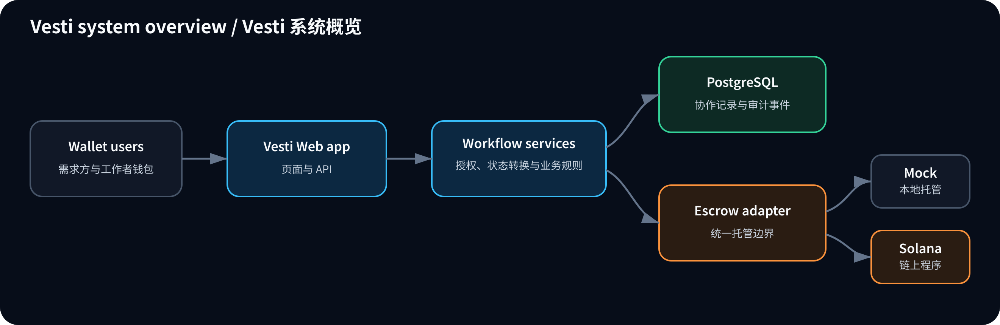

# Vesti

[English](README.md) | [简体中文](README.zh-CN.md)

Vesti 是面向远程协作的里程碑式 USDC 托管产品，为需求方与工作者提供统一流程，用于约定交付内容、记录履约进度，并以可追溯的方式释放付款。

## 用户视角

### 需求方

需求方可以：

- 创建私有合约，或发布公开项目。
- 定义多个里程碑，并确保里程碑金额之和等于合约总额。
- 选择工作者、为托管账户注资并跟踪交付进度。
- 查看每一版交付证明、请求修改、批准成果并释放付款。
- 对进行中且尚未付款的里程碑发起争议。

### 工作者

工作者可以：

- 加入被直接分配的合约，或申请公开项目。
- 查看里程碑范围、金额、截止日期和合约历史。
- 提交交付证明，且不会覆盖以前的版本。
- 响应修改请求，并跟踪批准和付款状态。
- 对进行中且尚未付款的里程碑发起争议。

双方均使用钱包地址标识身份。系统根据用户角色和当前合约状态，只展示其有权执行的操作。

## 用户流程

1. 需求方定义工作内容和里程碑。
2. 工作者由需求方直接指定，或从公开项目申请者中选定。
3. 需求方为托管账户注资，合约随即生效。
4. 工作者提交当前里程碑的交付证明。
5. 需求方批准证明，或请求修改。
6. 已批准的资金释放给工作者。
7. 重复上述流程，直至所有里程碑均完成付款。

如果协作无法继续，任一参与方都可以发起争议。Mock 托管支持双方协商的“释放给工作者”或“退回需求方”方案：一方提出结果，另一方接受后执行。链上争议结算会保持禁用，直至 Solana 程序能够强制执行同等规则。

## 系统设计

系统将协作状态与资金托管状态分离：

- 应用负责合约、里程碑、证明历史、申请、评论、争议和事件时间线。
- 托管边界负责注资和付款执行；统一适配器用于保持 Mock 与链上流程的行为一致性。
- 授权和状态转换统一在服务层执行，页面和 API 路由不得自行定义业务规则。
- 证明提交与合约事件采用只追加记录；资金操作使用幂等键和唯一交易签名。
- 链上交易先由钱包签名，确认后再进行对账；只有对账成功，本地资金状态才会推进。

## MVP 边界与就绪状态

当前仓库包含完整的 Mock 托管流程，以及实验性的 Solana devnet 钱包签名注资和付款流程。实际使用 devnet 仍需要部署程序、配置测试 USDC Mint，并完成端到端验证。产品暂不提供法币支付、KYC、法律仲裁、多链结算或生产级链上争议处理。

## 项目文档

- [技术设计](docs/technical-design.zh-CN.md)：代码结构、领域模型、API、配置和工程规范。
- [运行指南](docs/operations.zh-CN.md)：本地启动、数据库生命周期、演示流程和质量检查。
- [链上托管](docs/onchain.zh-CN.md)：Solana 程序状态、指令、部署标识和程序命令。
