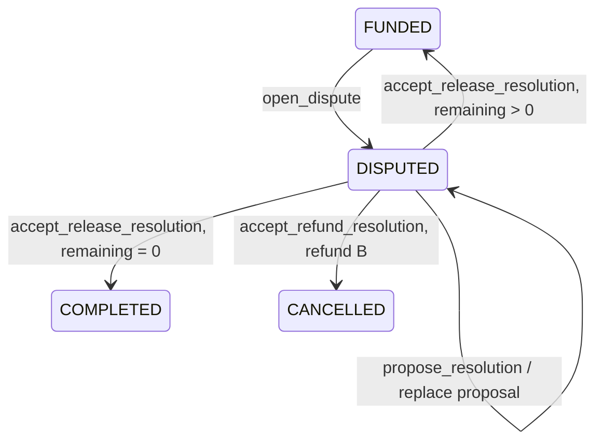

# 迭代 1 详细设计：链上争议资金出口

> 设计更新（2026-09-29）：本文件主体描述默认「双方协商」路径。用户要求在创建前可选方式，因此本轮另加「预先指定仲裁钱包」路径，具体账户、指令和边界见第 9 节。下文所称「无协议时冻结」仅适用于默认路径或指定仲裁钱包也无法介入的情况。

## 1. 目标与边界

本轮完成 Anchor 程序中的链上争议状态和资金出口，并在本地验证器上证明真实 Token 转账及失败回滚。按新增的创建前策略选择要求，本轮也调整合同创建页面、数据库、注资交易构建与策略对账。Web 链上争议入口仍关闭；争议交易准备、钱包交互、数据库争议对账和 Devnet 升级属于后续迭代。

当前 [`open_dispute`](../programs/vesti-escrow/src/lib.rs) 可把托管状态从 `FUNDED` 设为 `DISPUTED`，但程序没有从该状态转出或退款的指令。目标是消除“双方已经达成协议，程序却没有可执行出口”的缺口。

结算规则沿用现有 Mock：需求方或工作者发起争议；任一方提出 `release_to_worker` 或 `refund_to_creator`；另一方接受后才转账。**链上发起规则则明确为合约级争议**：任何一方在合约已注资时都能冻结整个托管；`milestone_id` 是争议关联与付款去重标识，程序无法凭现有账户证明它属于数据库合约，也无法验证数据库里的可争议状态。Mock/Web 仍只允许对属于合约且处于可争议状态的里程碑发起；直接调用链上程序可以绕过该 Web 限制。迭代 2 必须发现此类链上先行争议，将数据库合约置于待核查状态，禁止继续准备付款，并由人工核对，不能静默忽略或虚构一个本地里程碑。对账器须按 `DisputeState.escrow` 查询程序账户并筛选未解决状态；未知里程碑哈希无法预先推导 PDA，不能只靠本地里程碑列表或易丢失的事件日志发现争议。

默认方式下双方不达成协议时，资金继续冻结；本轮不增加单方超时提款。用户已选择允许创建前指定独立仲裁钱包作为可选资金出口。即使选择该方式，仲裁钱包与双方都不行动时仍可能长期冻结，不能宣称“任何情况下资金必能退出”。

## 2. 资金语义

设 `F = escrow.funded_amount`、`R = escrow.released_amount`、`B = F - R`。`B` 只表示**结算前尚未释放给工作者的本金**，不是取消后的可支取余额。所有数值均为 Mint 最小单位 `u64`，运算使用受检整数，不使用浮点数。

| 结果 | 转账 | 最终状态 | 账务约束 |
| --- | --- | --- | --- |
| `release_to_worker` | 金库向绑定工作者 Token 账户转入提案中的 `A` | 若 `R + A == F` 则 `COMPLETED`，否则回到 `FUNDED` | `0 < A <= B`；创建该里程碑付款凭证；`released_amount = R + A` |
| `refund_to_creator` | 金库向绑定需求方 Token 账户转入全部 `B` | `CANCELLED` | `B > 0`；不得再注资、付款或发起争议；争议记录保存实际退款额 |

终态账本定义为：`refunded = (status == CANCELLED ? F - R : 0)`，`outstanding = F - R - refunded`。退款交易必须同时满足 `DisputeState.outcome == refund_to_creator`、`settled_amount == refunded`、金库转出额等于 `refunded`；取消后 `outstanding == 0`。不向兼容的 `EscrowState` 追加字段；迭代 2 对账从托管状态计算累计退款额，再与争议 PDA、转账指令及数据库 `refundedAmount` 交叉验证。例：注资 100、已付款 60、退款 40 后，`R = 60`、`refunded = 40`、`outstanding = 0`，不能继续把 `F - R = 40` 当作可支取余额。额外误转入的 Token 不计入该本金账本。

`release_to_worker` 的 `A` 由双方共同确认。现有链上托管账户不保存里程碑清单或数据库批准状态，因此程序无法独立证明 `A` 等于数据库里程碑金额；后续 Web 迭代必须绑定并对账该金额。本轮程序只确保双方同意、金额不超出剩余本金、收款地址正确及同一里程碑不重复付款。

多里程碑合约中，释放争议里程碑后如果 `B - A > 0`，合约恢复 `FUNDED`，未争议资金保留在金库。退款始终退还**全部剩余本金**并终止合约，不能仅退款当前里程碑后继续执行。外部若向金库误转入额外 Token，不增加 `F` 或 `B`，也不能被当作争议本金结算；其后续处理另立清理策略。程序不能依赖“金库余额必须恰好等于本金”的检查，否则第三方误转入可造成拒绝服务。

## 3. 账户与地址

保留现有 `EscrowState` 的字段与长度，新增状态常量 `CANCELLED`，不把变长争议内容塞入托管账户。新增永久保留的 `DisputeState` PDA：

```text
seeds = ["dispute", escrow_pubkey, SHA256(UTF8(milestone_id))]
```

固定字段：`escrow: Pubkey`、`milestone_hash: [u8; 32]`、`reason_hash: [u8; 32]`、`opened_by: Pubkey`、`state: u8`（0=open、1=proposed、2=resolved）、`proposed_by: Pubkey`、`outcome: u8`（0=none、1=release_to_worker、2=refund_to_creator）、`proposed_amount: u64`、`proposal_version: u64`、`settled_amount: u64`、`resolved_by: Pubkey`、`bump: u8`。未赋值的公钥用默认值，版本初始为 0；账户总空间为 `8 + 219 = 227` 字节，事件与 IDL 不使用隐式变长字符串表示这些枚举。原因正文保留在应用数据库；链上只存其哈希并发出哈希事件。哈希不能替代数据库访问控制，尤其对容易猜测的短文本不提供保密保证。已核实 Devnet 有旧程序及经典 SPL Token 托管账户，升级时必须保持这些账户的兼容性；不以本地生成的密钥对推断网络状态。

沿用现有里程碑付款凭证 PDA：

```text
seeds = ["release", escrow_pubkey, SHA256(UTF8(milestone_id))]
```

争议释放成功时也必须初始化该凭证，确保之后的普通 `release_milestone` 和再次争议释放不能为同一里程碑付款。发起争议前检查对应付款凭证尚未存在。新的 `DisputeState` 不在解决后关闭：留存结果以阻止同一里程碑重新开启争议，并保留链上审计依据。每个合约同时只允许一个活动争议，由 `EscrowState.status == DISPUTED` 限制。未登记链上里程碑清单是本轮有意接受的边界；若产品要求链上也校验里程碑归属与状态，必须在注资前增加不可篡改的里程碑承诺，并同步调整现有 Web 初始化和注资交易，本轮不能假装只补一项 `open_dispute` 检查即可做到。

## 4. 指令与状态转换



### `open_dispute`

- 输入：`milestone_id: String`、`milestone_hash: [u8; 32]`、`reason_hash: [u8; 32]`。程序重算并验证里程碑哈希；原因正文不进链。
- 账户：托管账户、发起人签名、按里程碑派生的新 `DisputeState`、对应付款凭证地址、系统程序；发起人支付新账户租金。
- 前置条件：托管状态为 `FUNDED`，发起人是需求方或工作者，`B > 0`，里程碑 ID 非空且 UTF-8 字节长度不超过 64，该 ID 的付款凭证不存在。**链上不声称校验数据库里程碑是否存在或处于可争议状态。**
- 效果：初始化 `DisputeState(open)`，记录发起人和原因哈希，把托管状态设为 `DISPUTED`，发出不含原因正文的事件。已有同一争议 PDA 或其他活动争议时失败。

### `propose_resolution`

- 输入：`outcome: u8`、`amount: u64`、`expected_current_version: u64`。退款时 `amount = 0`；释放时 `0 < amount <= B`。Mock 当前按里程碑面额释放，没有独立的提案金额字段；链上仍显式记录双方同意的金额，后续 Web 必须限制为该里程碑面额，并在接受前核对数据库与链上提案。
- 账户：托管账户、对应活动争议 PDA、提议人签名。
- 前置条件：托管状态 `DISPUTED`，争议归属该托管账户且尚未解决，提议人是双方之一，当前版本等于 `expected_current_version`。旧版本的并发覆盖必须失败。
- 效果：存储提议方、结果、金额，并递增 `proposal_version`；再次提议会替换上一提议。事件包含版本、结果和金额。版本使用受检递增。

### `accept_release_resolution`

- 输入：`expected_proposal_version: u64`、`expected_amount: u64`。指令本身固定结果为 `release_to_worker`，两项输入都必须与当前提案一致。
- 账户顺序：可写托管账户、可写争议 PDA、可写接受人签名账户（付款凭证租金付款人）、工作者钱包账户、绑定的 Mint、可写金库、可写工作者 Token 账户、按同一哈希 `init` 的付款凭证 PDA、经典 SPL Token Program、System Program。
- 前置条件：接受人是提议方之外的另一名参与者；提案为 `proposed` 且结果为释放；工作者钱包等于 `escrow.worker`；Mint、金库、工作者 Token 账户的 owner/authority、PDA 种子与托管状态一致；`expected_amount > 0` 且不超过 `B`。付款凭证已存在时初始化失败，不用 `init_if_needed`。
- 效果：以托管 PDA 签名转出 `expected_amount`，初始化并填写付款凭证，`R` 增加该金额；若 `R == F` 则 `COMPLETED`，否则回到 `FUNDED`。争议标记为已解决，记录实际金额及接受人。

### `accept_refund_resolution`

- 输入：`expected_proposal_version: u64`、`expected_refund_amount: u64`。指令本身固定结果为 `refund_to_creator`，提案金额必须为 0，预期退款额必须等于当前 `B` 且大于 0。
- 账户顺序：可写托管账户、可写争议 PDA、接受人签名账户、需求方钱包账户、绑定的 Mint、可写金库、可写需求方 Token 账户、经典 SPL Token Program。不创建付款凭证，也不需要 System Program。
- 前置条件：接受人是提议方之外的另一名参与者；提案为 `proposed` 且结果为退款；需求方钱包等于 `escrow.creator`；Mint、金库、需求方 Token 账户的 owner/authority 与托管状态一致。
- 效果：以托管 PDA 签名一次性转出 `B`，争议记录 `settled_amount = B`，托管状态变为 `CANCELLED`；`R` 保持不变，此后按终态账本推导累计退款额。

两条接受指令均重新校验争议 PDA 种子、`dispute.escrow`、版本、提议方和接受人身份；任何账户初始化、转账或受检金额计算失败时，整笔交易不得留下部分状态。事件固定为 `DisputeOpened(escrow, milestone_hash, actor, reason_hash)`、`ResolutionProposed(escrow, milestone_hash, proposed_by, outcome, amount, version)`、`DisputeResolved(escrow, milestone_hash, accepted_by, outcome, settled_amount, released_amount, refunded_amount, status, version)`，其中释放时 `refunded_amount=0`，退款时为实际转出本金，不输出原因正文。实现前按上述顺序生成 IDL，并用测试核对账户元数据和事件字段。

## 5. 必须保持的不变量

1. 只有托管状态 `FUNDED` 可开启争议；只有该合约当前未解决的 `DisputeState` 可提案或接受。链上争议权限按合约而非数据库里程碑状态判断。
2. 只有需求方与工作者可提案；接受人必须是另一方。管理员、服务器和未参与钱包没有提款权限。
3. `released_amount <= funded_amount`；退款前的金额是 `funded_amount - released_amount`，退款后 `outstanding = 0`；累计付款加累计退款不能超过 `funded_amount`。
4. `initialize_escrow` 必须拒绝 Token-2022 的 Mint/Token Program；`mark_funded`、普通 `release_milestone` 和两条争议接受指令都只接受经典 SPL Token Program，且 Mint、金库与收款 Token 账户的程序所有者、Mint、Token owner/authority 必须一致。金库 authority 必须是托管 PDA。转账使用 `transfer_checked` 和受检整数。若发现已部署的 Token-2022 托管账户，不得升级成只允许经典 Token 结算的版本，先单独制定可退出的兼容方案。
5. 争议解决只能发生一次；释放型解决与普通付款共用同一付款凭证去重。
6. 旧版本的提议覆盖和接受交易均失败；更换结果或金额后必须由对方重新签署。
7. `CANCELLED` 与 `COMPLETED` 均为资金操作终态；`FUNDED` 仅在争议释放后还有剩余本金时恢复。

## 6. 本地验证器测试矩阵

测试必须部署真实 SBF 程序，创建测试 Mint 和 Token 账户，并比较交易前后的 Token 余额及链上账户，不用 Mock 适配器替代。

| 类别 | 场景与断言 |
| --- | --- |
| 正常释放 | 注资 100，争议金额 60；需求方提议、工作者接受；工作者 +60，金库本金 40，托管回 `FUNDED`，付款凭证存在；另一里程碑仍可付款 40。 |
| 反向角色 | 工作者提议释放、需求方接受，结果与正向角色一致。 |
| 全额退款 | 已正常付款 60 后，对剩余里程碑发起争议并退款；需求方 +40，金库本金 0，托管 `CANCELLED`。 |
| 终态账本 | 上述退款后 `F=100`、`R=60`、争议 `settled_amount=40`、推导 `refunded=40`、`outstanding=0`；重读账户并按事件和 Token 余额交叉核对。 |
| Token 边界 | 经典 SPL Token 的初始化、注资、普通付款和两种争议结算都成功；Token-2022 Mint/程序在初始化时被拒绝，不能产生只可注资而不可退款的托管。 |
| 链上先行争议 | 参与方直接以数据库中不存在或尚不可争议的里程碑 ID 发起链上合约级争议，程序会冻结合约但不能声称验证该 ID；迭代 2 的 Web 对账用未知哈希识别并隔离，不继续准备付款。 |
| 失败与回滚 | 提议方自行接受、第三方操作、错误 Mint/金库/收款 owner、金额 0 或超过余额、收款账户缺失、Token CPI 失败；余额、状态、凭证和争议版本保持原值。 |
| 重放与竞态 | 重复 `open_dispute`、重复接受、对已释放里程碑开争议、普通付款与争议释放使用同一 ID、两个提议基于同一旧版本并发覆盖、旧版提案签名在新版提案后提交；均不能重复转出本金或意外替换提案。 |
| 边界 | 多里程碑部分付款、第三方误转入金库的额外 Token、ID 长度上限、哈希不匹配、提案版本溢出、状态终结后再次调用。 |

测试输出应列出每个场景的交易结果、程序日志、托管状态和余额差额。`cargo check`、IDL 生成和静态单测不能替代这些本地链上行为测试。

## 7. 实施顺序和交付物

1. 按已确认的双模式规则实现，并核对程序已有部署账户及其 Token Program。若要求强制最终退出或链上校验里程碑，先重做状态机与注资前承诺方案。保留已部署程序 ID；本地使用测试钱包，并把测试网络锁定为本地验证器。仅使用测试密钥；不提交私钥。
2. 先把经典 SPL Token 限制落实到现有初始化、注资和普通付款路径，再定义 `DisputeState`、状态常量和错误码；调整 `open_dispute`，实现提议和两条接受指令。
3. 为每条资金路径补本地验证器测试，尤其是失败回滚、提案版本和付款凭证重放。
4. 用真实测试替换 `Anchor.toml` 的占位脚本；CI 增加 Anchor/Solana 工具链安装或固定构建环境、足够的超时及缓存，再实际运行格式、编译、IDL 和本地程序测试。保持现有 Web 的链上争议开关关闭。
5. 更新中英文链上文档：指令、PDA、余额语义、错误码、验证命令与“无协议时持续冻结”的限制。

本轮不进行远程部署、不更改生产或 Devnet 配置。按新增策略选择要求，已增加 PostgreSQL 迁移和 Web 创建、Mock 仲裁及注资路径；链上争议页面入口仍关闭。已确认 Devnet 存在旧程序及经典 SPL 托管账户，但本轮未升级；不得依靠 `anchor keys sync` 覆盖现有程序 ID。

## 8. 退出门槛与下一轮接口

- `cargo fmt --check`、Rust 测试、Anchor 构建、IDL 生成和本地验证器资金测试均通过；CI 实际执行本地程序测试，不运行占位 `echo`。
- 两种争议结果和部分付款后的余额逐笔可复核；所有失败和重复请求不转出额外资金。
- 新指令的 IDL 与本设计固定的账户顺序、参数和事件字段一致，供迭代 2 的 Web 交易构造器与对账器使用。
- 文档明确：双方达成协议即可链上结算；默认方式无协议时资金长期冻结，仲裁方式则由预先指定钱包裁决。正式版前仍需业务与法律审查。迭代 2 的 Web 对账还须处理直接链上发起的未知里程碑争议，并按终态本金账本核对，不能因金库有第三方额外转入就误判正常结算。

## 9. 创建前可选的仲裁策略

- 默认「双方协商」沿用 `initialize_escrow`；无策略 PDA 即代表默认方式，包括旧托管账户。
- 「指定仲裁钱包」在创建合约时记录独立钱包地址，注资交易原子执行 `initialize_escrow_with_arbitrator` 与 `mark_funded`。前者创建 `["policy", escrow_pubkey]` PDA，固定 `escrow`、`arbitrator`、模式和 bump。仲裁钱包不得与需求方或工作者相同；公开招募时，指定仲裁钱包也不能成为工作者。策略账户只能初始化一次，注资后无法修改。Web 对账检查指令及策略账户内容与数据库选择一致。
- 双方提议与接受仍可使用。仲裁钱包另外可对未解决争议执行 `arbitrate_release_resolution(amount)` 或 `arbitrate_refund_resolution(expected_refund_amount)`；释放需要同一里程碑付款凭证，退款为全部未释放本金。仲裁指令不要求已有双方提案，但只接受绑定的仲裁钱包签名；完成后沿用第 2 节终态账本。
- Mock 路径的仲裁释放使用数据库里程碑面额。链上程序无法独立证明面额，故迭代 2 必须约束并对账 Web 提交的仲裁金额。Web 链上争议入口在该能力完成前保持关闭。
- 该模式不实现仲裁钱包失联后的自动超时退出。已部署 Devnet 程序仍为旧版本；本轮只完成本地验证器验收，不触发远程升级。

## 依据

- 仓库内：[总体交付计划](final-delivery-plan.zh-CN.md)、[技术设计](technical-design.zh-CN.md)、[当前链上实现](../programs/vesti-escrow/src/lib.rs)。
- [Anchor 账户约束](https://www.anchor-lang.com/docs/references/account-constraints)：PDA、初始化、签名、Token 账户约束。
- [Anchor Token 转账](https://www.anchor-lang.com/docs/tokens/basics/transfer-tokens)：`transfer_checked` 与 CPI 所需账户。
