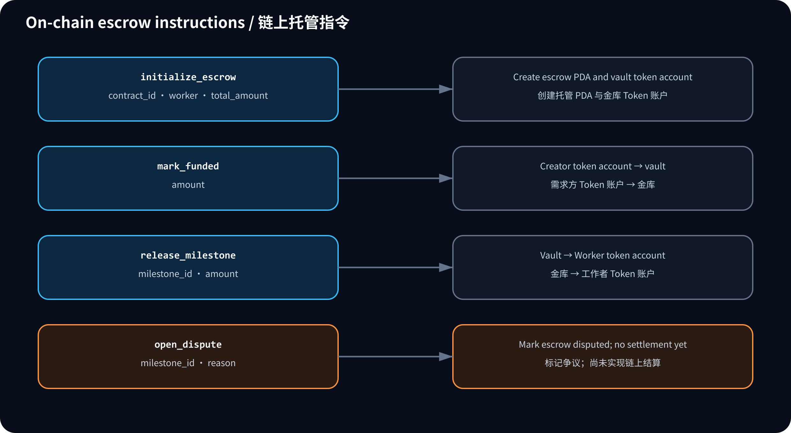

# Vesti 链上托管

[English](onchain.md) | [简体中文](onchain.zh-CN.md)

本文档记录 Vesti 的 Rust/Solana 阶段。

## 当前状态

仓库包含 Anchor 托管程序：

```text
programs/vesti-escrow/
```

程序只接受经典 SPL Token Program，保留现有托管账户布局，已实现争议释放、退款和预先指定仲裁钱包。Anchor CLI 1.0.2 与 Agave/Solana CLI 3.1.14 的本地构建和验证器资金测试通过。Web 注资交易根据创建时的规则建立默认托管或仲裁策略账户；前端签名提交后，对账器检查交易指令、托管账户、策略账户和余额。Web 链上争议入口仍关闭，待后续迭代完成其交易与数据库对账。

## 程序 ID

程序 ID（已部署旧版本于 Devnet；本轮未升级）：

```text
ErFsmiKY7WxjD9ArYmpqjCCUKnTcfzLm6tFpmWdFU9ck
```

升级 Devnet 前，须核对升级权限、已有托管账户和构建产物，并保持以下位置一致：

- `Anchor.toml`
- `programs/vesti-escrow/src/lib.rs`
- `.env` / `.env.example` 中的 `ESCROW_PROGRAM_ID`

## 指令



`initialize_escrow` 创建：

- 托管 PDA：`["escrow", contract_id]`
- 金库 Token 账户 PDA：`["vault", contract_id]`

`contract_id` 会直接用作 PDA Seed，因此不得超过 32 字节。当前 Prisma `cuid()` 合约 ID 满足该限制。

`mark_funded` 将完整合约金额从需求方 Token 账户转入金库。`release_milestone` 使用托管 PDA 签名，将已批准的里程碑金额从金库转入工作者 Token 账户。

默认「双方协商」使用 `initialize_escrow`，不创建策略账户。任一参与方可用 `open_dispute` 冻结已注资托管；`propose_resolution` 保存带版本的放款或退款提议；另一方用 `accept_release_resolution` 或 `accept_refund_resolution` 接受。若无协议，资金保持冻结。

「指定仲裁钱包」使用 `initialize_escrow_with_arbitrator`，同时创建 `["policy", escrow_pubkey]` PDA，保存独立于双方的仲裁钱包，策略不能更换。双方仍可协商，仲裁钱包也可直接调用 `arbitrate_release_resolution` 或 `arbitrate_refund_resolution`。旧账户没有策略 PDA 时按默认方式处理。仲裁钱包失联后仍能通过双方协商解决，但没有自动超时退出。

争议 PDA 为 `["dispute", escrow_pubkey, SHA256(UTF8(milestone_id))]`，仅保存原因哈希；链上不能验证里程碑是否属于数据库合同。争议释放和普通付款共用 `["release", escrow_pubkey, SHA256(UTF8(milestone_id))]` 凭证。退款金额为 `funded_amount - released_amount`，退款后状态为 `CANCELLED`，可支取本金余额为 0；金库额外误转入的 Token 不计入本金。链上允许双方或仲裁钱包提出不超过剩余本金的释放额，后续 Web 争议对账必须限制为数据库里程碑金额。

Web 端账户推导辅助函数位于：

```text
lib/blockchain/solana-escrow-accounts.ts
```

当前 Web 链路会在付款时创建尚不存在的工作者经典 SPL 关联 Token 账户。Token-2022 Mint 在链上初始化时被拒绝。链上争议页面入口仍禁用，Mock 模式可使用已选定的仲裁规则。

Web 端 Anchor 指令与交易构建器位于：

```text
lib/blockchain/anchor-encoding.ts
lib/blockchain/solana-escrow-instructions.ts
lib/blockchain/solana-escrow-transactions.ts
```

## 后续链上任务

- 接入 Web 链上争议准备、签名、提交、确认与对账，完成端到端验收后再启用页面入口。
- 核对 Devnet 升级权限与现有账户，升级精确构建产物并完成测试资金验收；本轮不部署。
- 使用真实测试 Mint、Phantom 和 Explorer 可确认的签名验证完整 devnet 流程。
- 在 UI 中保存或展示 Explorer 链接以及更完整的对账诊断信息。

## 本地命令

在 Windows 上使用 WSL 运行 Rust/Solana 工具链。当前验证版本为：

```bash
anchor --version          # anchor-cli 1.0.2
solana --version          # solana-cli 3.1.14
cargo build-sbf --version # solana-cargo-build-sbf 3.1.14
```

宿主机 libc 支持预编译二进制时，可以使用 AVM 安装 Anchor CLI 1.0.2。在 Ubuntu 22.04 上应改为从源码构建：

```bash
cargo install --git https://github.com/solana-foundation/anchor --tag v1.0.2 anchor-cli --force
```

构建链上程序需要 Anchor。

```bash
cargo fmt --manifest-path programs/vesti-escrow/Cargo.toml
cargo check --manifest-path programs/vesti-escrow/Cargo.toml
anchor build --ignore-keys --provider.cluster localnet
corepack pnpm test:onchain
```

仓库内测试密钥对与已部署程序 ID 不同；`--ignore-keys` 仅供本地构建，验证器显式加载源码程序 ID。不要通过 `anchor keys sync` 覆盖已部署 ID。`Anchor.toml` 的测试脚本运行本地验证器资金测试，不使用 Devnet。

如果未安装 Anchor，仍需继续验证 Web 应用：

```bash
corepack pnpm prisma validate
corepack pnpm lint
corepack pnpm build
cargo check --manifest-path programs/vesti-escrow/Cargo.toml
```
