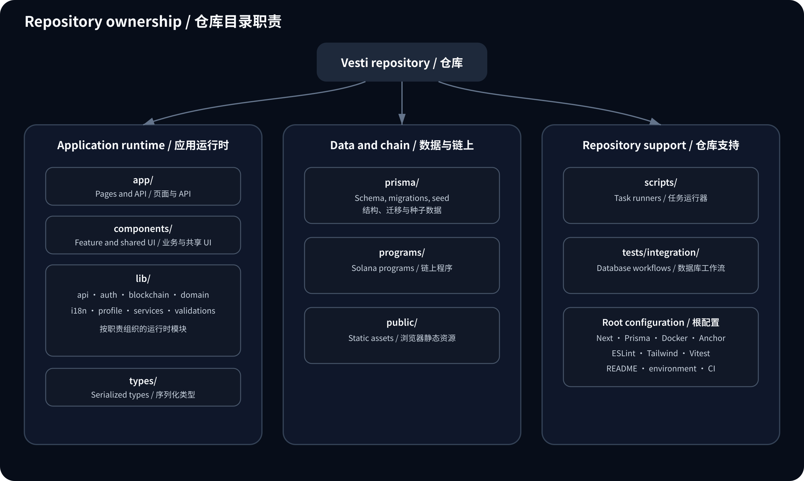
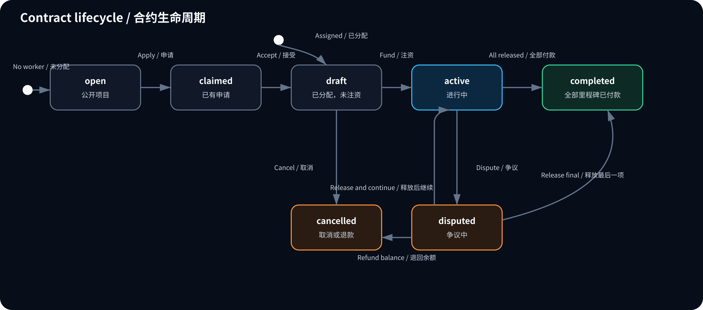
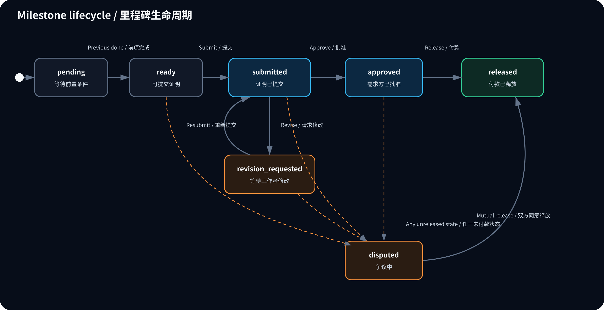
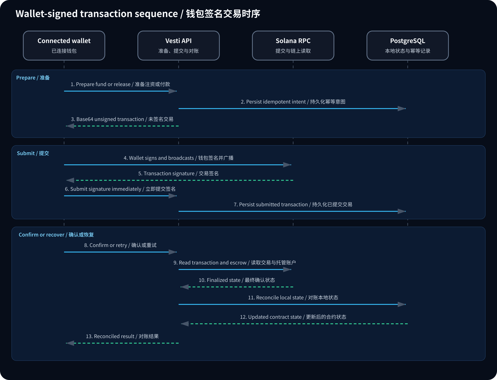

# Vesti Technical Design

[English](technical-design.md) | [简体中文](technical-design.zh-CN.md)

This document is the developer reference for the Vesti MVP. Product intent and the user journey live in the [README](../README.md); setup procedures live in [operations.md](operations.md); Solana program details live in [onchain.md](onchain.md).

## Architecture

Vesti uses a layered Next.js application with a separate Solana escrow program:

- `app/` contains pages and thin API route handlers.
- `components/` contains feature and shared UI components.
- `lib/validations/` parses request data with Zod.
- `lib/services/` owns authorization, state transitions, persistence, and event creation.
- `lib/domain/` contains shared domain rules and view-model helpers.
- `lib/blockchain/` defines the escrow adapter and Solana transaction integration.
- `lib/profile/` contains reusable avatar and participant-display helpers.
- `prisma/` defines the PostgreSQL model, migrations, and seed data.
- `programs/vesti-escrow/` contains the Anchor-compatible Rust escrow program.
- `scripts/` contains repository-level task runners rather than application runtime code.
- `tests/integration/` contains cross-domain, database-backed workflow tests.
- `types/` contains application-facing TypeScript types.

Pages and routes must call the service layer for business behavior. They must not duplicate role checks, financial invariants, or state transitions.

### Directory ownership



Repository-root files are limited to framework manifests, tool configuration, environment examples, and primary documentation. Unit tests stay beside the module they verify; integration tests live outside production runtime directories. Generated directories such as `.next/`, `target/`, and `node_modules/`, together with local logs and secrets, are ignored by Git.

### Repository root

| File or group | Root-level responsibility |
| --- | --- |
| `README.md`, `README.zh-CN.md` | Product and system entry points. |
| `package.json`, `pnpm-lock.yaml`, `.node-version` | Node.js runtime and dependency definition. |
| `next.config.mjs`, `next-env.d.ts`, `tsconfig.json` | Next.js and TypeScript configuration. |
| `eslint.config.mjs`, `postcss.config.mjs`, `tailwind.config.ts`, `components.json` | Code quality and UI build configuration. |
| `prisma.config.ts` | Prisma CLI entry point; schema and migrations remain under `prisma/`. |
| `docker-compose.yml` | Local PostgreSQL service definition. |
| `Anchor.toml` | Anchor workspace and Solana deployment configuration. |
| `.env.example` | The single committed environment-variable template. |
| `vitest.config.ts`, `vitest.integration.config.ts` | Unit and integration test discovery. |
| `.editorconfig`, `.gitattributes`, `.gitignore` | Encoding, line-ending, generated-file, secret, and dependency rules. |
| `.github/workflows/ci.yml` | Pull-request and main-branch verification pipeline. |

## Technology baseline

- Next.js 16, React 19, and TypeScript
- Tailwind CSS and reusable UI components
- PostgreSQL and Prisma
- Zod request validation
- Solana Wallet Adapter and `@solana/web3.js`
- Rust, Anchor, and the classic SPL Token Program
- Vitest for unit tests and a TypeScript integration runner for database-backed workflows

The Web transaction path currently targets the classic SPL Token Program. Token-2022 support is outside the current MVP.

## Domain model

### Contract lifecycle

Contracts use the following main states:



- `open` is a public project that can receive applications.
- `claimed` means a worker has requested the project and awaits creator acceptance.
- `draft` has an assigned worker but is not funded.
- `active` is funded and allows milestone delivery.
- `completed` means all milestone funds have been released.
- `cancelled` is a draft cancellation or a disputed contract whose remaining escrow was refunded.
- `disputed` blocks the normal milestone workflow until settlement.

Only the creator can fund or cancel a draft contract. Milestone amounts must equal the contract total, and released plus refunded value cannot exceed funded value.

### Milestone lifecycle



Only the assigned worker can submit proof. Each submission creates a new `ProofSubmission` version instead of replacing prior evidence. Only the creator can request a revision, approve proof, or release an approved milestone.

### Disputes

Either participant can dispute an active, unreleased milestone. In mock mode:

1. One participant proposes `release_to_worker` or `refund_to_creator`.
2. The other participant accepts the proposal.
3. The service settles the milestone, updates aggregate amounts, and appends events.

A participant cannot accept their own proposal. On-chain dispute actions fail closed because the Solana program does not yet implement settlement instructions.

### Audit and transaction records

`Event` is the append-only collaboration timeline. `EscrowTransaction` records financial operation intent and progress with:

- action and adapter mode;
- wallet, contract, milestone, and amount;
- unique idempotency and operation keys;
- a unique transaction signature when submitted;
- `prepared`, `submitted`, `confirmed`, `reconciled`, or `failed` status;
- timestamps and failure diagnostics.

Funding and release must be idempotent. A confirmed chain transaction is reconciled against the expected instruction and escrow account state before local amounts or statuses change.

The browser persists a transaction signature immediately after submission and calls `POST /api/transactions/submit` before waiting for confirmation. Submitted transactions remain recoverable after navigation or a temporary client failure. A separately scheduled reconciliation task leases due records, retries with exponential backoff, and marks exhausted records for operations review; multiple workers cannot claim the same lease concurrently.

## Authentication and authorization

Production-style authentication uses a wallet challenge and signed-message verification. The verified session is stored in an HTTP-only cookie. The server derives the acting wallet from that session and ignores request-body wallet fallbacks while a valid session exists. A body wallet is accepted only when the explicit, non-production demo bypass is enabled.

Wallet challenges are consumed with a conditional database update so concurrent verification attempts cannot reuse one signature. Challenge and verification endpoints use database-backed limits for both the wallet and the proxy-provided client address. Browser POST requests with an `Origin` header must match the application origin.

The demo wallet bypass is disabled by default and is only for explicit local demos. It must not be enabled in a production deployment.

Authorization is role- and state-based:

- Creator actions: accept a claim, fund, cancel, request revision, approve, and release.
- Worker actions: apply or claim and submit proof.
- Participant actions: comment, open a dispute, propose a settlement, or accept the counterparty's settlement.

## API design

Workflow APIs use `POST`, including reads that require structured filters. Entity identifiers are sent in JSON bodies rather than dynamic URL segments. The profile avatar is the single `GET` endpoint because it serves image bytes.

### Authentication

```text
POST /api/auth/challenge
POST /api/auth/verify
POST /api/auth/session
POST /api/auth/logout
```

### Contracts and collaboration

```text
POST /api/contracts/create
POST /api/contracts/list
POST /api/contracts/get
POST /api/contracts/claim
POST /api/contracts/accept-claim
POST /api/contracts/fund
POST /api/contracts/cancel
POST /api/contracts/delete
POST /api/contracts/rename
POST /api/contracts/visibility
POST /api/contracts/comments/create
```

### Milestones and disputes

```text
POST /api/milestones/submit-proof
POST /api/milestones/request-revision
POST /api/milestones/approve
POST /api/milestones/release
POST /api/milestones/dispute
POST /api/milestones/propose-dispute-resolution
POST /api/milestones/accept-dispute-resolution
```

### Wallet-signed transactions

```text
POST /api/transactions/prepare-fund
POST /api/transactions/confirm-fund
POST /api/transactions/prepare-release
POST /api/transactions/confirm-release
POST /api/transactions/submit
```

Prepare endpoints build a base64 Solana transaction for the connected wallet. The submit endpoint durably records the signature as soon as the wallet broadcasts it. Confirm endpoints verify the committed instruction and resulting escrow state, then reconcile the local record.



### Profile

```text
POST /api/profile/update
GET  /api/profile/avatar
```

### System

```text
POST /api/health
```

The health endpoint verifies database connectivity and reports the configured escrow mode and network. Every API response returns an `x-request-id` header; error bodies include the same identifier for log correlation.

Route handlers should only parse the request, call a service, and map known errors to HTTP responses. Validation and business rules belong in their dedicated layers.

## Escrow adapter boundary

`ESCROW_ADAPTER_MODE` selects the implementation:

- `mock` executes deterministic local state changes and supports bilateral dispute settlement.
- `onchain` prepares and reconciles wallet-signed funding and release transactions against the Solana program.

The Web application must not silently fall back from on-chain to mock behavior. Unsupported on-chain operations return an explicit error.

## Configuration

Copy `.env.example` to `.env` for local development.

| Variable | Purpose |
| --- | --- |
| `DATABASE_URL` | PostgreSQL connection string. |
| `NEXT_PUBLIC_APP_URL` | Browser-visible application origin. |
| `NEXT_PUBLIC_SOLANA_NETWORK` | Wallet network, currently `devnet`. |
| `NEXT_PUBLIC_SOLANA_RPC_URL` | Solana JSON-RPC endpoint. |
| `NEXT_PUBLIC_USDC_MINT` | Classic SPL test USDC mint. |
| `ESCROW_ADAPTER_MODE` | `mock` by default; use `onchain` only for configured devnet testing. |
| `ESCROW_PROGRAM_ID` | Deployed Vesti escrow program address. |
| `RECONCILIATION_BATCH_SIZE` | Maximum submitted transactions claimed by one reconciliation run. |
| `RECONCILIATION_MAX_ATTEMPTS` | Retry attempts before a submitted transaction requires operations review. |
| `AUTH_SECRET` | Server secret used to protect wallet sessions. |
| `DEMO_WALLET_AUTH_ENABLED` | Server-side local demo bypass switch. |
| `NEXT_PUBLIC_DEMO_WALLET_AUTH_ENABLED` | Client-side local demo wallet switch. |

The current program identifier is documented in [onchain.md](onchain.md) so deployment-specific information has one source of truth.

## Engineering rules

- Use `Decimal` for USDC values; do not use JavaScript floating-point arithmetic for persisted financial calculations.
- Preserve the invariant `releasedAmount + refundedAmount <= fundedAmount <= totalAmount`.
- Prevent a released milestone from being released again.
- Keep proof submissions and event history append-only.
- Persist idempotency before invoking an external financial operation.
- Keep API handlers thin and return explicit validation, authorization, state, and infrastructure errors.
- Preserve request IDs across API boundaries so production errors can be traced without exposing internal details.
- Add migrations for schema changes and keep seed data aligned with the current model.
- Do not add marketplace, chat, fiat, KYC, legal arbitration, multi-chain, reputation, or public-profile features to the MVP without a separate product decision.

## Development commands

Use Node.js 20+ and Corepack.

```bash
corepack pnpm install
corepack pnpm dev
corepack pnpm lint
corepack pnpm test
corepack pnpm test:integration
corepack pnpm build
corepack pnpm check
corepack pnpm check:full
corepack pnpm reconcile:transactions
corepack pnpm cleanup:operational
corepack pnpm prisma validate
corepack pnpm prisma generate
corepack pnpm prisma migrate dev
corepack pnpm prisma studio
corepack pnpm seed
```

Use [operations.md](operations.md) for the ordered local startup, Docker database commands, demo data, and quality-check procedure.
